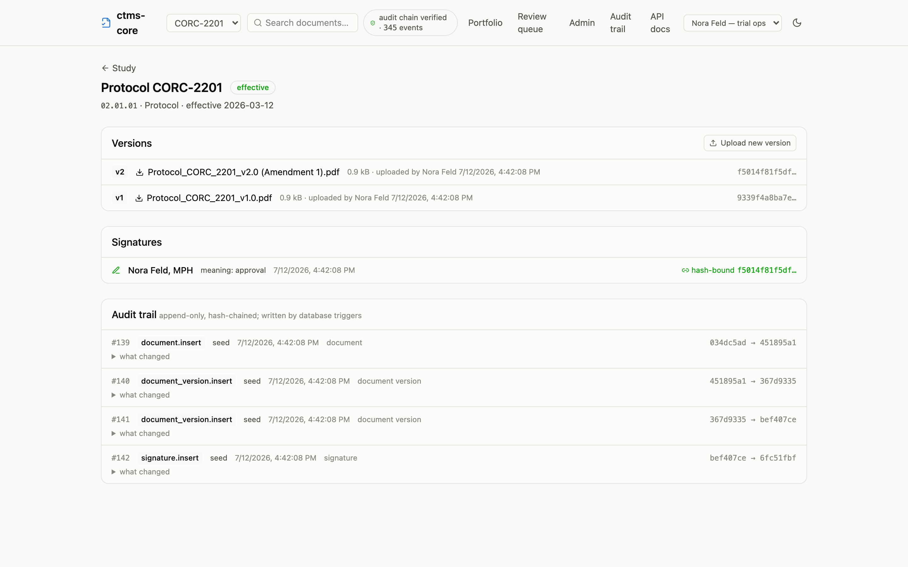

What "compliant-by-design" means here: the mechanisms 21 CFR Part 11 and ICH
E6(R3) require are properties of the database schema, enforced below the
application layer. What it does **not** mean: that this software is validated.

::: {.callout-warning}
## Not validated software
Formal computer system validation — GAMP 5 categorization, risk assessment,
IQ/OQ/PQ, SOPs, training records — is a separate, deliberate program that has
not been performed. This page maps requirement → mechanism so that a future
validation effort inherits architecture instead of retrofit. Read the claims
below with that framing.
:::

## 21 CFR Part 11 — electronic records

| Requirement | Mechanism |
| --- | --- |
| §11.10(a) validation of systems | **Not claimed**, but the raw material is generated, not hand-written: `pnpm validation:iq` checks a live environment's installed controls, `pnpm validation:artifacts` emits an OQ run report and the [requirement traceability matrix](validation.qmd). Formal CSV (GAMP 5, SOPs, training) remains an organizational program |
| §11.10(b) accurate and complete copies | Every version's bytes are content-addressed (sha256) and immutable; the API serves originals at `/files/{sha256}` |
| §11.10(c) record protection & retention | Versions, signatures, and audit events reject UPDATE/DELETE via database triggers, for every role |
| §11.10(d) limited system access | OIDC/SSO (`AUTH_MODE=oidc`): JWTs validated against the identity provider's issuer, audience, and key set; the verified email claim resolves to a person, or the request is refused — never a fallback actor. The API runs as a least-privilege database role (DML only). A dev-token mode remains for the demo and is not a Part 11 posture |
| §11.10(e) audit trails | Computer-generated, timestamped `audit_event` rows written by AFTER-triggers on every domain-table mutation; append-only; prior values preserved as full row images; hash-chained so retroactive edits are detectable |
| §11.10(g) authority checks | Role-based grants (admin / trial_ops / monitor / read_only / ingest / site_staff over read / upload / sign / approve / administer / log, scoped to study or site; ingest is the machine-identity role for source-system filing, ADR-0011; site_staff is the site seat and log gates writing a site's own DoA/training entries, ADR-0023) enforced per route; grant changes are themselves audited. Actor identity bound per transaction |
| §11.50 signature manifestation | Signature rows carry signer, timestamp, and meaning (author/review/approval); the UI displays all three |
| §11.70 signature/record linking | Each signature stores a copy of the signed version's content hash, so the binding is verifiable independently of the version row |
| §11.200 signature components | Signing requires re-authentication: in OIDC mode a freshly issued token for the same subject within a short freshness window; method and time are recorded on the signature row, and a database CHECK requires them on every new signature. Bulk approval is a §11.200(a)(1)(i) series of signings — one re-authentication opens the series, every version still gains its own recorded signature |

## ICH E6(R3) — essential records

E6(R3) (final January 2025) reframes "essential documents" as "essential
records," with explicit expectations of version control, identifiability, and
accessibility — language that favors a records-as-data design over
folders-of-PDFs.

| Expectation | Mechanism |
| --- | --- |
| Records identifiable, version-controlled | Typed by TMF RM artifact + scoped identity; monotonic immutable versions |
| Completeness of essential records | Requirement rules + `v_expected_document_status`: expected-vs-actual is continuously computed, per site and per person |
| Access, availability, readability | Relational queries + a documented API; records retrievable by identity, not folder-path memory |
| Records protected from unauthorised alteration and from inappropriate destruction or accidental loss (2.12.9, 3.16.1(v)) | Database-level immutability; deletes of domain rows are themselves audited events |
| Protection of blinding / privacy when sharing | Out of scope this phase (single-tenant demo; no blinded roles yet) |

## What this looks like in the product

Every document page shows the three mechanisms side by side: immutable
versions with their content hashes, signatures displaying signer, meaning, and
timestamp (§11.50) with the hash they are bound to (§11.70), and the
trigger-written audit trail with each event's link in the hash chain.

{.screenshot fig-alt="Protocol document page showing two immutable versions with sha256 hashes, an approval signature bound to a content hash, and audit trail events with hash chain links"}

## Try the mechanisms yourself

The claims above are testable from a terminal:

```sh
# Walk the hash chain end-to-end
curl -s http://localhost:8787/audit-chain/verify \
  -H "Authorization: Bearer dev-admin-token" | jq

# Try to rewrite history (the database refuses, regardless of role)
docker exec -i ctms-core-db-1 psql -U postgres -d ctms \
  -c "UPDATE audit_event SET action = 'nothing happened' WHERE id = 1;"
# ERROR: audit_event is append-only
```

The automated test suite includes DB-level immutability tests that attempt
exactly these mutations and assert they fail.

## Honest gaps (current phase)

1. **The validation *program* is not performed** — the software generates its
   raw material ([traceability matrix, IQ and OQ reports](validation.qmd)),
   but a CSV dossier also needs SOPs, risk assessment, training records, and a
   QMS to live in. That is organizational work no repository can contain.
2. **Dev mode still exists** — `AUTH_MODE=dev` and the dev-grade database role
   passwords are demo affordances. A pilot must run `AUTH_MODE=oidc` and
   rotate role credentials (see the deployment checklist in the repo's
   `docs/05-deployment.md`); nothing in the code forces that choice.
3. **WORM depends on deployment** — the s3 storage driver with Object Lock
   extends immutability to the document bytes; the default local-directory
   driver does not. `pnpm validation:iq` flags which one an environment runs.
4. **Single tenant** — one deployment per customer; multi-tenancy hardening
   remains a non-goal of this phase.
5. **`expected_document` churn is unaudited by design** — placeholders are
   derived state; the ground truth they derive from is fully audited. The
   same stance covers extracted search text (ADR-0022): rebuildable at any
   time from the immutable, audited bytes.

Resolved since the first draft of this page: dev-token-only auth (now
OIDC + RBAC), stubbed signing re-authentication, unblocked TRUNCATE
(least-privilege runtime role), and the 40-artifact taxonomy ceiling
(verbatim CDISC importer).
