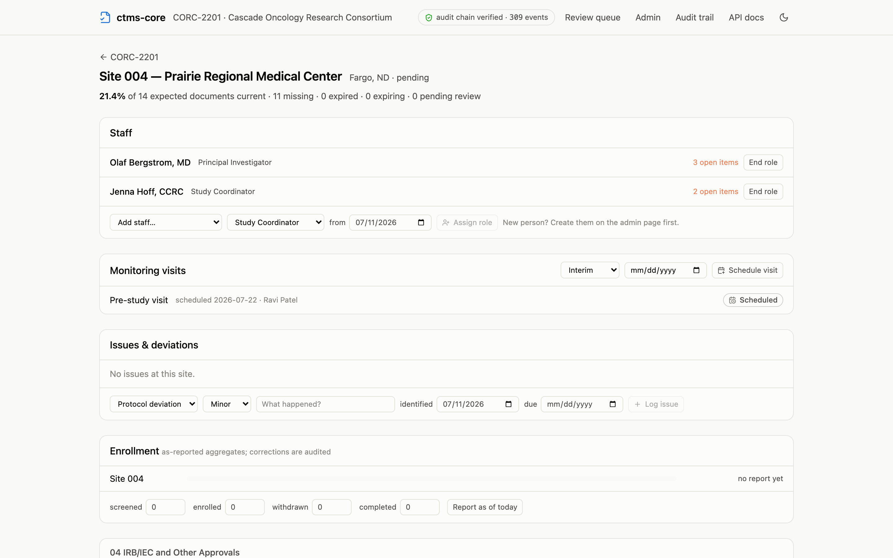
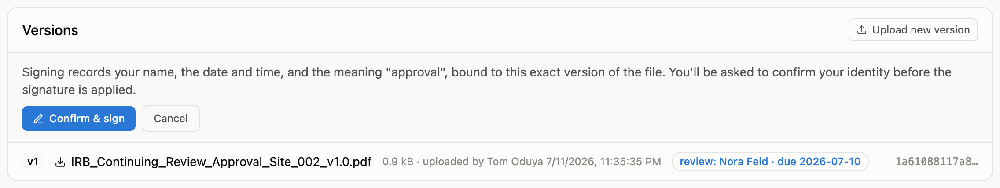
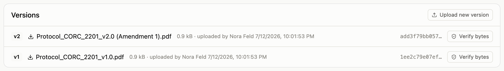
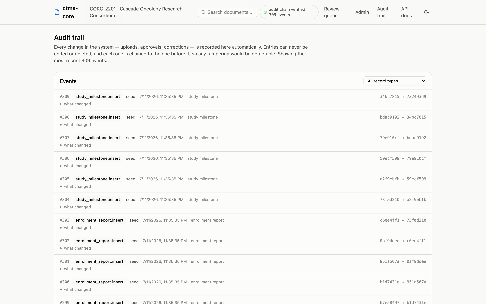

Documents move through a simple loop: someone uploads a file, it waits in
**pending review**, and an approval signature makes it **current**. This page
walks that loop in the app, plus what to do when a document needs a new
version.

## Uploading a document

Uploads happen on the site page, right on the row that needs the file. Open
the site (from the matrix or the enrollment card), find the requirement — the
rows are grouped by TMF zone — and the rows marked **Missing** or **Expired**
carry an **Upload** button.

{.screenshot fig-alt="Site detail page showing expected documents grouped by TMF zone, with upload buttons on missing and expired rows"}

Pick the file and you're done — the app knows which requirement, site, and
person the row belongs to, so there's nothing to classify and no folder to
choose. The row flips to **Pending review**, and the document now waits for
someone to approve it.

If the row is for a person (a CV, a medical license, a GCP certificate), the
upload is filed to that person automatically.

## What "pending review" means

A pending-review document is filed but not yet trusted: it doesn't count as
current anywhere until someone with approval authority signs it. This is the
review step — open the document, download and read the file, and either
approve it or upload a corrected version over it.

## Approving and signing

On the document's page, **Approve & make effective** starts the signature.
The app first shows you exactly what signing records, then asks you to
confirm:

{.screenshot fig-alt="Document versions card showing the signing confirmation panel with Confirm and sign and Cancel buttons above the version list"}

After you confirm, you'll be asked to verify your identity — in a production
deployment that means re-entering your credentials with the organization's
sign-in provider. This is deliberate, not a glitch: an electronic signature
here is the real thing, so the system checks it's really you at the moment of
signing.

The signature records your name, the date and time, and its meaning
(approval), and it is tied to the exact file you signed — if anyone ever
swapped the file, the signature would no longer match. The document becomes
**Current**, and every count and matrix cell that depends on it updates
immediately.

## Uploading a new version

When a document needs an update — an amended protocol, a renewed license — you
don't delete anything. Open the document and use **Upload new version** in the
Versions card:

{.screenshot fig-alt="Document versions card showing version history with download links and an Upload new version button"}

The new version joins the history and the document goes back to **Pending
review** until the new version is approved. Every prior version stays
downloadable forever, and the signatures on old versions remain attached to
exactly what was signed.

Two things you won't find, on purpose:

- **No delete button.** Versions can't be deleted or replaced — that's a
  regulatory property enforced by the database itself. An upload mistake is
  fixed by uploading the right file as the next version.
- **No new-version button on trip reports.** Visit documents belong to their
  visit; each visit's report is its own record, uploaded from the
  [visit page](monitoring-visits.qmd).

## Documents filed by other systems

Not every upload comes from a person. Connected systems — an electronic data
capture system, for example — can file documents into the binder
automatically. A version filed this way looks like any other in the Versions
card, with one addition: a small chip reading **filed by** and the system's
name, so the file's origin is never a mystery.

Automated filings get no special treatment. They land in **Pending review**
exactly like a hand upload, and a person with approval authority still reads
and signs before anything counts as current. The connected system itself
can never sign or approve — see
[who can do what](index.qmd#who-can-do-what).

## The audit trail, briefly

Every document page ends with its audit trail: every insert, update, and
signature, who did it, and when, written automatically by the database. The
**audit chain verified** badge in the app header — and the study-wide audit
page it links to — is the same record across the whole system.

{.screenshot fig-alt="Audit trail page listing recent events with action badges, actor names, timestamps, and hash chain fragments, with a record type filter"}

You never write to the audit trail and you can't edit it; it simply accrues.
If an auditor asks "show me everything that happened to this record," this
page is the answer.
