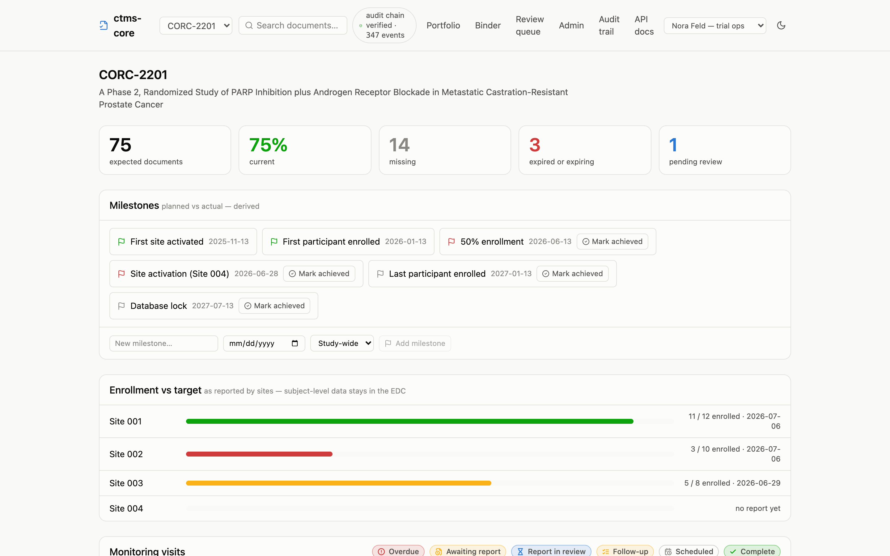

This guide is for the people who run studies: CRAs, study coordinators, TMF
specialists, and anyone else on a clinical operations team. It walks through
the everyday tasks — uploading documents, approving and signing, running
monitoring visits, logging deviations, reporting enrollment — as they look in
the app, with no code. If you script against the API or query the database
directly, the [cookbook](../cookbook.qmd) covers the same tasks in R, Python,
and curl.

One idea explains most of what you'll see: **the app never asks you to update
a status**. You record what happened — a document was uploaded, a visit was
conducted, an issue was resolved — and every status on every page is computed
from those facts each time the page loads. Nothing needs to be remembered,
refreshed, or reconciled, and a status can never be out of date.

## The dashboard

The dashboard is the study at a glance. Everything on it is clickable, and
every filter you apply lands in the page address, so a filtered view can be
pasted straight into an email or a chat. Running more than one study? The
dropdown in the header switches between them (the app remembers your
choice), and the **Portfolio** page shows every study's numbers side by
side.

{.screenshot fig-alt="ctms-core study dashboard showing expected document counts, percent current, milestone chips, and enrollment progress bars per site"}

From top to bottom:

- **The count tiles** summarize document completeness: how many documents the
  study expects right now, what share are current, and how many are missing,
  expired or expiring, or waiting for review. These are totals of the same
  statuses you'll see item by item further down.
- **Milestones** shows planned-versus-actual for the study's key dates. Green
  means achieved, red means the planned date has passed, grey means upcoming.
  You can add milestones and mark them achieved right on this card — see
  [enrollment and milestones](enrollment-milestones.qmd).
- **Enrollment vs target** shows each site's latest self-reported counts
  against its target. Sites report their own numbers on their site pages.
- **Monitoring visits** lists every visit with its current stage. The chips in
  the card header filter the list — click "Overdue" to see only visits that
  need attention. The [monitoring visits](monitoring-visits.qmd) page walks
  the full lifecycle.
- **Issues & deviations** lists findings and protocol deviations with severity
  and status, and includes the form for logging a new one — see
  [issues and deviations](issues.qmd).
- **The site document matrix** is the heart of the oversight view.

## Reading the site document matrix

Each row is a required document; each column is a site. A cell shows the worst
status for that requirement at that site — if three of four staff have current
GCP certificates, the cell shows the one that's missing, with a count.

{.screenshot fig-alt="Site document matrix grid showing TMF requirements as rows, four sites as columns, and status icons in each cell"}

Hover any cell for the detail (who is missing what), and click it to land on
the site's page, where the fix — usually an upload — is one button away.
Every status icon pairs a shape with a label, so nothing depends on color
alone; the full set is listed in [what the statuses mean](statuses.qmd).

## The pages under the dashboard

- A **site page** (click any site) holds the site's staff roster — each
  person with their role and a count of their open document items — plus the
  [delegation of authority and training logs](site-logs.qmd), visits, issues,
  enrollment reporting, and the site's expected documents grouped by TMF
  zone, each with an upload button where one is needed.
- A **visit page** (click any visit) walks a monitoring visit from scheduled
  through conducted, trip report, action items, and completion.
- A **document page** (click any document) shows its versions, signatures,
  and complete history.
- The **audit trail** link in the header opens the study-wide record of every
  change ever made — see [the audit trail, briefly](documents.qmd#the-audit-trail-briefly).

One more thing lives in the header: a small badge reading **audit chain
verified**, with a running count of recorded events. The app re-verifies the
integrity of the entire audit trail as you work and shows the result at all
times — if the record had ever been tampered with, the badge would read
**BROKEN**. Clicking it opens the audit trail.

## Who can do what

Every account (and every connected system) holds an access role, optionally
limited to one study or one site. Oversight roles all see the same pages —
what the role controls is *actions*, and the pages only offer the actions
your role can actually perform: a monitor sees no approve button, a read-only
seat sees no forms at all. The server checks again at the moment you act, so
nothing rests on the page being right.

| Role | What it can do |
| --- | --- |
| **Administrator** | Everything below, plus study administration |
| **Trial operations** | Read, upload, sign, and approve documents |
| **Monitor** | Read, upload, and sign — but not approve |
| **Read-only** | View everything, change nothing (the auditor's seat) |
| **Site staff** | Their own site only: read, upload, sign, and keep the site's logs |
| **Ingest** | Read and upload only — held by connected systems, never people |

Three of these deserve a note. **Read-only** is how an auditor or inspector is
given the run of the record without any risk of changing it — see
[the auditor's seat](inspection.qmd) for the binder and the byte
verification that seat is built around. **Site staff** is
the one role with a different surface: a person scoped to a single site lands
on that site's page and works entirely there — see
[the site seat and its logs](site-logs.qmd). **Ingest** is for
software: when another system (an EDC, for example) files documents
automatically, it does so under this role, which can never sign or approve —
an electronic signature always requires a person. See
[working with documents](documents.qmd#documents-filed-by-other-systems) for
how those filings appear.

## Where to go next

- [Working with documents](documents.qmd) — upload, review, sign, and
  version documents.
- [Monitoring visits](monitoring-visits.qmd) — the visit lifecycle, start to
  finish.
- [Issues and deviations](issues.qmd) — logging and resolving findings.
- [Enrollment and milestones](enrollment-milestones.qmd) — reporting counts
  and tracking key dates.
- [Administration](administration.qmd) — onboarding sites, staffing them,
  granting access, adjusting requirement rules, and waiving expected
  documents.
- [The site seat and its logs](site-logs.qmd) — the site-scoped view, and
  the delegation of authority and training logs.
- [What the statuses mean](statuses.qmd) — every chip in the app, and what to
  do about each.
- [Glossary](../glossary.qmd) — the trial and system terms used throughout.
