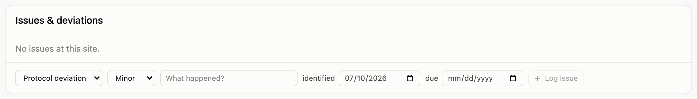
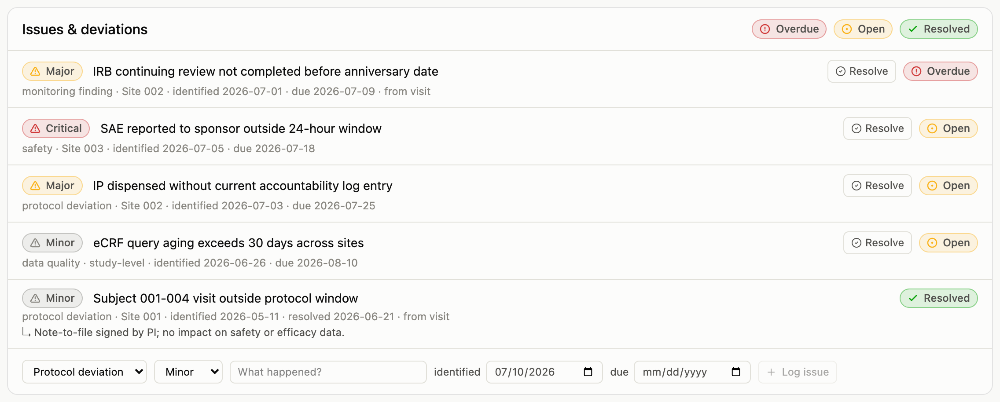

An issue is anything that needs tracking to resolution: a protocol deviation,
a monitoring finding, a safety concern, a data-quality problem. Issues carry a
severity (minor, major, critical) and dates (identified, due, resolved), and
their status is computed from those dates alone. An issue past its due date
without a resolution shows **Overdue** by itself; there is no flag anyone has
to remember to flip.

## Logging an issue

The form sits at the bottom of the issues card, wherever you are:

- **On the dashboard**, for study-level issues that don't belong to one site.
- **On a site page**, for issues at that site.
- **On a visit page**, for findings identified during a monitoring visit;
  these stay linked to the visit that found them.

{.screenshot fig-alt="Issues and deviations card showing a form with category and severity selectors, a title field, identified and due dates, and a Log issue button"}

Pick the category and severity, describe what happened, and set a due date if
the issue has a deadline for resolution. The identified date defaults to
today.

## Working the list

The dashboard's issues card shows everything across the study, newest first,
with severity and status chips. The chips in the card header filter the list
(click **Overdue** for the items that need attention today), and the filtered
view is a pasteable link.

{.screenshot fig-alt="Issues and deviations list showing severity badges, derived status badges, resolve buttons, and a form for recording a new issue"}

## Resolving

**Resolve** on any open issue stamps the resolution date. Resolution notes (what
was done, the note-to-file reference) appear under the issue once
recorded. As with everything else, resolving an issue is an audited change:
the full history of who logged it, who resolved it, and when, is preserved
automatically.
