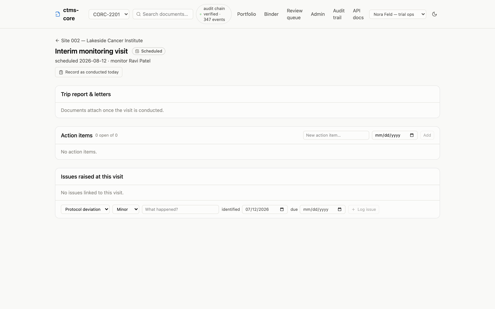

A monitoring visit moves through six stages, and you never set any of them.
Each stage is computed from what has actually happened: the dates recorded,
the trip report's status, and how many action items remain open. Your job is
just to do the next thing; the stage follows.

| When you see… | It means… | The next step is… |
| --- | --- | --- |
| **Scheduled** | The visit date is still ahead | Nothing, until the visit happens |
| **Overdue** | The scheduled date passed with no visit recorded | Conduct the visit and record it |
| **Awaiting report** | Conducted, but no trip report yet | Upload the trip report |
| **Report in review** | Report uploaded, not yet approved | Review and approve the report |
| **Follow-up** | Report approved, action items still open | Resolve the action items |
| **Complete** | Report approved, everything resolved | Nothing; you're done |

## Scheduling a visit

Visits are scheduled from the site page: pick the visit type (pre-study,
initiation, interim, or close-out) and the date, and the visit appears on the
site page and the dashboard as **Scheduled**.

{.screenshot fig-alt="Monitoring visit page in the scheduled stage showing the scheduled date and empty trip report and action item sections"}

If the scheduled date passes without a visit being recorded, the stage flips
to **Overdue** on its own; nobody has to notice.

There's no reschedule button yet: if a visit date genuinely needs to move,
that's currently an API change your data team can make in one call (see the
[cookbook](../cookbook.qmd#the-cras-week)).

## Recording the visit

On the visit's page, **Record as conducted today** stamps the visit date.
That's the whole step: the visit moves to **Awaiting report**, and the
trip-report upload appears.

## The trip report

Upload the trip report from the visit page. The report is a real document (it
gets the same version history and signatures as everything else), and the
visit holds at **Report in review** until someone approves it.

**Review & approve** on the report row takes you to the document page, where
approval works exactly as described in
[working with documents](documents.qmd#approving-and-signing): a confirmation
step, an identity check, and a signature bound to the exact file.

The reviewer can also send the report back:
[return it for correction](documents.qmd#returning-for-correction) with a
reason. The visit drops back to **Awaiting report**, and the visit page's
upload button reads **Upload corrected report**; the corrected report goes
through review like the first one, and the returned one stays on the record.

## Action items and closing out

Findings from the visit go in as action items: a description and a due date,
added right on the visit page. Open items hold the visit in **Follow-up**
even after the report is approved; an item past its due date shows as
overdue. Resolving the last one is what completes the visit.

{.screenshot fig-alt="Interim monitoring visit page showing a follow-up stage badge, an effective trip report, three action items in different states, and an issue raised at the visit"}

If a finding is bigger than a to-do (a protocol deviation, a safety concern),
log it as an issue from the same page, and it stays linked to the visit that
found it. See [issues and deviations](issues.qmd).
