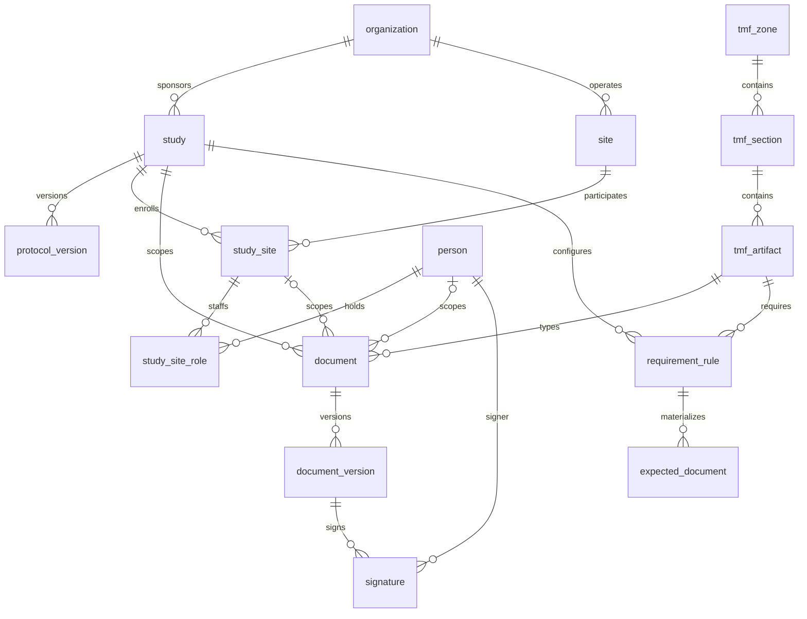

# Data model

Postgres is the system of record. Schema lives in `packages/db/src/schema.ts`
(Drizzle); DDL that Drizzle can't express — audit triggers, immutability guards,
derived-status views — lives in a companion SQL migration. Everything below is a table
unless marked *view*.

## Reference taxonomy

- **tmf_zone / tmf_section / tmf_artifact** — the CDISC TMF Reference Model v3.x
  hierarchy (11 zones → 48 sections → 249 artifacts in the official model). We seed an
  **illustrative subset** (~40 artifacts across Trial Management, Regulatory, IRB/IEC,
  Site Management, IP, Safety zones), flagged in the seed; the official CDISC
  spreadsheet is importable later without schema change. Artifacts carry their model
  number (e.g. `03.01.02`) as a stable business key.

## Organizational spine

- **organization** — sponsor, CRO, or site institution (`kind`).
- **study** — protocol number, title, phase, status; FK to sponsoring organization.
- **protocol_version** — labeled versions with effective dates; requirement rules can
  demand re-collection per version (e.g. amended protocol signature pages).
- **site** — a physical/institutional site, FK to organization.
- **study_site** — the site's participation in a study: site number, lifecycle status
  (`pending → active → closed`), activation date. Most site-level documents hang here.
- **person** — a human (name, email, credentials label). Persons, not "users": login
  identity maps onto persons at the API layer.
- **study_site_role** — a person holding a role (PI, sub-investigator, coordinator,
  pharmacist, research nurse) at a study-site, with start/end dates. Role assignments
  are auditable facts and the anchor for person-scoped requirements.

## Documents

- **document** — one logical record: FK to `tmf_artifact` (its type) plus scope
  columns: `study_id` (always), `study_site_id` (site-scoped), `person_id`
  (person-scoped; CHECK: person scope requires site scope — a CV is filed per site).
  Lifecycle `status`: `pending_review → effective → superseded`. Optional
  `effective_date` / `expires_at` (licenses, approvals, training certificates).
- **document_version** — **immutable** (DB triggers reject UPDATE/DELETE): version
  number, `sha256` of content, filename, MIME type, size, uploader, timestamp. File
  bytes live in a content-addressed store (`storage/<sha256>` in dev; S3-compatible
  later); the database holds metadata and the hash.
- **signature** — Part 11 e-signature record: signer, `meaning`
  (`author | review | approval`), timestamp, and `signed_sha256` — a copy of the
  version's content hash taken at signing, making the record↔signature binding
  (§11.70) verifiable independently of the version row. Immutable like versions.

## Requirement engine

- **requirement_rule** — declarative, per study: which `tmf_artifact`, at which
  `scope_level` (`study | study_site | person_role`), for which roles (array, when
  person-scoped), `validity_months` (null = never expires), `requires_signature`.
- **expected_document** — placeholders materialized from rules: one row per rule ×
  in-scope entity (the study; each active study-site; each active matching role
  assignment). Idempotent sync in `packages/core` inserts missing placeholders and
  removes unfulfilled ones whose scope entity left (role ended, site closed).
- **v_expected_document_status** (*view*) — the heart of the system. Joins each
  placeholder to its best fulfilling document (same artifact + scope, latest
  effective) and derives status:
  `missing | pending_review | current | expiring_soon (≤60d) | expired | superseded`.
  No stored status column exists anywhere — completeness is always computed from
  ground truth, so it cannot drift.
- **v_study_site_completeness** (*view*) — per-site rollup: counts by status, percent
  current.

## Audit trail

- **audit_event** — append-only, **written by database triggers on every
  INSERT/UPDATE/DELETE to domain tables**, not by application discipline. Captures
  actor (from `set_config('ctms.actor_id', …)` established per transaction by the API),
  action, entity type/id, full `before`/`after` JSONB row images, timestamp, and a
  **hash chain**: `hash = sha256(prev_hash ‖ canonical event fields)` computed in-DB
  (pgcrypto), serialized with an advisory lock. Any retroactive edit breaks every
  subsequent hash — tampering is detectable by walking the chain.
- UPDATE/DELETE on `audit_event` itself raises at the database level, for every role
  including the owner. Part 11 §11.10(e)'s "changes shall not obscure previously
  recorded information" is a property of the schema, not a code path.

## Deliberate choices

1. **Derived status over stored status** — a stored `is_complete` flag is how
   incumbent systems drift from reality. Views are always right. (ADR-0004)
2. **Trigger-written audit over app-written audit** — ad-hoc SQL, future services, and
   bugs all leave the same trail; there is no unaudited write path. (ADR-0003)
3. **Content-addressed files** — the sha256 is both storage key and the signable,
   auditable identity of the bytes; duplicate uploads deduplicate for free.
4. **Persons over users** — identity/authn is swappable (SSO later); the regulated
   facts attach to people.
