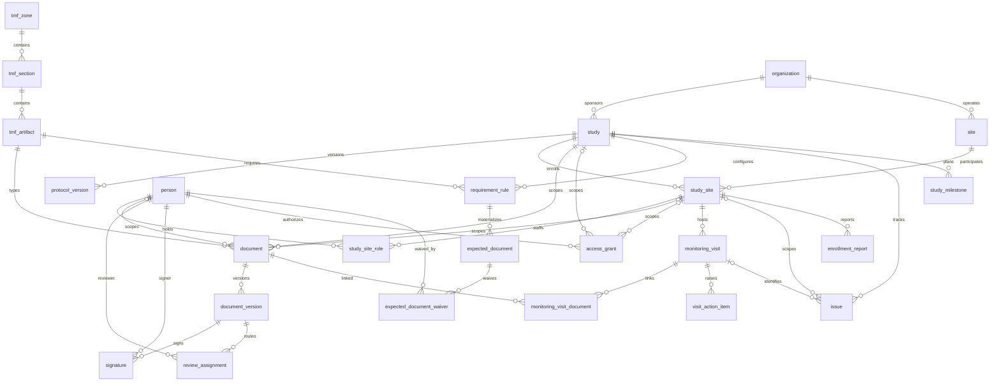

# Data model

Postgres is the system of record. Schema lives in `packages/db/src/schema.ts`
(Drizzle); DDL that Drizzle can't express — audit triggers, immutability guards,
derived-status views — lives in a companion SQL migration. Everything below is a table
unless marked *view*.

## Reference taxonomy

- **tmf_zone / tmf_section / tmf_artifact** — the CDISC TMF Reference Model v3.x
  hierarchy (11 zones of numbered sections and artifacts in the official model;
  counts come from the imported spreadsheet, per ADR-0012). We seed an
  **illustrative subset** (~40 artifacts across Trial Management, Regulatory, IRB/IEC,
  Site Management, IP, Safety zones), flagged in the seed; `pnpm db:import-tmf`
  loads the official CDISC spreadsheet verbatim, upserting by artifact number with
  no schema change (ADR-0005). Artifacts carry their model number (e.g. `03.01.02`)
  as a stable business key.

## Organizational spine

Everything in this section is writable through the admin API surface
(ADR-0016) — the seed script is no longer the only writer. Endings are dated
facts (`end_date`, `revoked_at`), never deletes.

- **organization** — sponsor, CRO, or site institution (`kind`).
- **study** — protocol number, title, phase, status; FK to sponsoring organization.
- **protocol_version** — labeled versions with effective dates; requirement rules can
  demand re-collection per version (e.g. amended protocol signature pages).
- **site** — a physical/institutional site, FK to organization.
- **study_site** — the site's participation in a study: site number, lifecycle status
  (`pending → active → closed`), activation date. Most site-level documents hang here.
- **person** — a human (name, email, credentials label). Persons, not "users": login
  identity maps onto persons at the API layer.
- **study_site_role** — a person holding a role (PI, sub-investigator, coordinator,
  pharmacist, research nurse) at a study-site, with start/end dates. Role assignments
  are auditable facts and the anchor for person-scoped requirements.
- **access_grant** — API authorization (ADR-0008): a person holds a role
  (`admin | trial_ops | monitor | read_only | ingest`), optionally scoped to one study or one
  study-site. Roles map to operations (read / upload / sign / approve / administer)
  in `packages/core/src/authz.ts`. Revocation is a `revoked_at` timestamp, never a
  delete, and grant changes are audited like any other row. Distinct from
  `study_site_role` on purpose: that table records regulated staffing facts;
  this one records system access.

## Documents

- **document** — one logical record: FK to `tmf_artifact` (its type) plus scope
  columns: `study_id` (always), `study_site_id` (site-scoped), `person_id`
  (person-scoped; CHECK: person scope requires site scope — a CV is filed per site).
  Lifecycle `status`: `pending_review → effective → superseded`, with a `returned`
  detour when review sends a version back (ADR-0015). Optional
  `effective_date` / `expires_at` (licenses, approvals, training certificates).
- **document_version** — **immutable** (DB triggers reject UPDATE/DELETE): version
  number, `sha256` of content, filename, MIME type, size, uploader, timestamp, and —
  when a source system filed it — `source_system`/`source_ref` provenance (ADR-0011). File
  bytes live in a content-addressed store behind a driver interface
  (`STORAGE_DRIVER=local` directory for dev, `s3` with Object Lock for WORM bytes —
  ADR-0009); the database holds metadata and the hash.
- **signature** — Part 11 e-signature record: signer, `meaning`
  (`author | review | approval`), timestamp, and `signed_sha256` — a copy of the
  version's content hash taken at signing, making the record↔signature binding
  (§11.70) verifiable independently of the version row. Also records
  `reauth_method` and `reauth_at` — the §11.200 re-authentication that produced
  the signature — required by a DB CHECK on every new row. Immutable like versions.
- **document_return** — the review outcome besides approval (ADR-0015):
  `document_version_id`, `returned_by`, `reason` (CHECK: non-blank), timestamp.
  Immutable like a signature; a returned version can never be approved — the fix
  is a corrected version, which reopens review.
- **review_assignment** — who should review a pending version, set by whom, due
  when (ADR-0018). No status column and no completion flag: an assignment is
  finished exactly when its version gains an approval signature or a return.
  Reassignment inserts a new row (the queue view reads the latest); assignment
  history stays on the document.
- **v_review_queue** (*view*) — every `pending_review` document's latest version,
  its latest assignment, and a derived `queue_status`
  (`unassigned | assigned | overdue`). Approval or return is what empties the
  queue; "my work" is a filter, not stored state.
- **v_document_search** (*view*) — one row per document with its searchable
  metadata (title, artifact taxonomy, site, person, uploader, file names,
  filing source, status) flattened into a lowercase `haystack` (ADR-0019).
  Search is every-token-must-match substring over this view — no index to
  drift from the record.

## Requirement engine

- **requirement_rule** — declarative, per study: which `tmf_artifact`, at which
  `scope_level` (`study | study_site | person_role`), for which roles (array, when
  person-scoped), `validity_months` (null = never expires), `requires_signature`.
- **expected_document** — placeholders materialized from rules: one row per rule ×
  in-scope entity (the study; each active study-site; each active matching role
  assignment). Idempotent sync in `packages/core` inserts missing placeholders and
  removes unfulfilled ones whose scope entity left (role ended, site closed).
- **expected_document_waiver** — why an expected document is not applicable
  (ADR-0016): waiver reason (CHECK: non-blank), who, when. Lifting a waiver sets
  `revoked_by`/`revoked_at`/`revoke_reason` once (CHECK: all three together, reason
  non-blank) — the resolve pattern, never a delete; a partial unique index allows one
  active waiver per placeholder, and history accumulates as revoked rows.
- **v_expected_document_status** (*view*) — the heart of the system. Joins each
  placeholder to its best fulfilling document (same artifact + scope, latest
  effective) and its active waiver, and derives status:
  `missing | waived | pending_review | returned | current | expiring_soon (≤60d) | expired | superseded`.
  `waived` appears exactly where `missing` would have — a filed document always wins
  over a waiver. No stored status column exists anywhere — completeness is always
  computed from ground truth, so it cannot drift.
- **v_study_site_completeness** (*view*) — per-site rollup: counts by status, percent
  current. Waived rows leave the percentage's denominator: an explained absence is
  not a gap.

## Operational layer

The CTMS features around the documents — monitoring visits, issues, enrollment,
milestones — follow the same rule as completeness: **facts in tables, lifecycle in
views** (ADR-0006). No table in this layer has a status column.

- **monitoring_visit** — a visit at a study-site: type
  (`pre_study | initiation | interim | close_out`), `scheduled_date`, `visit_date`
  (null until conducted), monitor, summary.
- **monitoring_visit_document** — links documents to visits with a kind
  (`trip_report | confirmation_letter | follow_up_letter`). Trip reports are ordinary
  documents: immutable versions, §11.70-bound approval signatures. Visit-linked
  documents are per-visit records — they are exempt from the supersede-siblings step
  on approval, and per-visit uploads always create a fresh document.
- **visit_action_item** — findings to close out: description, `due_date`,
  `resolved_at`/`resolved_by`/note.
- **issue** — protocol deviations and findings, scoped to the study or a site,
  optionally linked to the visit that identified them: category, severity, identified/
  due/resolved dates, resolution note.
- **enrollment_report** — as-reported operational aggregates per (site, `as_of_date`):
  screened/enrolled/withdrawn/completed. Subject-level clinical data stays in the EDC —
  a firm scope boundary. Corrections are audited UPDATEs, not silent overwrites.
  `study_site.target_enrollment` holds the site's target.
- **study_milestone** — planned vs actual dates, study- or site-scoped.

Derived views: **v_monitoring_visit_status** (stage: `scheduled → overdue →
awaiting_report → report_pending_review → follow_up → complete`, computed from the
dates, the linked trip report's document status, and open action items; a
returned trip report drops the visit back to `awaiting_report`, ADR-0015),
**v_issue_status** (`open | overdue | resolved`), **v_site_enrollment** (latest report
per site vs target), **v_milestone_status** (`achieved | overdue | upcoming`).

### Views are public API

The `v_*` views are not internals: they are the documented, stable query surface. A
data scientist with a read-only Postgres connection (DBI/dbplyr in R, psycopg or
SQLAlchemy in Python) reads the same derived truth the REST API serves — the two can
never disagree, because the API is just `SELECT`s over these views. Treat view columns
like endpoint fields: additive changes are safe, renames/removals are breaking.

## Audit trail

- **audit_event** — append-only, **written by database triggers on every
  INSERT/UPDATE/DELETE to domain tables**, not by application discipline. Captures
  actor (from `set_config('ctms.actor_id', …)` established per transaction by the API),
  action, entity type/id, full `before`/`after` JSONB row images, timestamp, and a
  **hash chain**: `hash = sha256(prev_hash ‖ canonical event fields)` computed in-DB
  (pgcrypto), serialized with an advisory lock. Any retroactive edit breaks every
  subsequent hash — tampering is detectable by walking the chain.
- UPDATE/DELETE on `audit_event` itself raises at the database level, for every role
  including the owner. Part 11 §11.10(e)'s "[r]ecord changes shall not obscure
  previously recorded information" is a property of the schema, not a code path.

## Deliberate choices

1. **Derived status over stored status** — a stored `is_complete` flag is how
   incumbent systems drift from reality. Views are always right. (ADR-0004)
2. **Trigger-written audit over app-written audit** — ad-hoc SQL, future services, and
   bugs all leave the same trail; there is no unaudited write path. (ADR-0003)
3. **Content-addressed files** — the sha256 is both storage key and the signable,
   auditable identity of the bytes; duplicate uploads deduplicate for free.
4. **Persons over users** — identity/authn is swappable (SSO later); the regulated
   facts attach to people.
