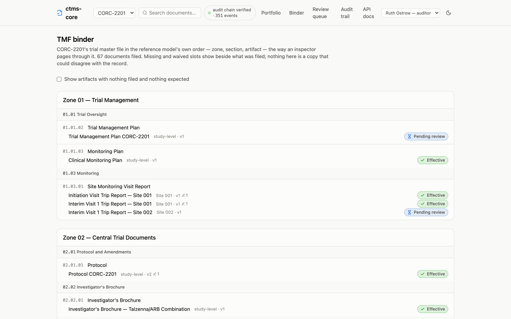
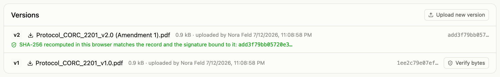

An inspection reads the record three ways: what is on file, what happened to
it, and whether the bytes on screen are really the bytes that were signed.
This page is how the app answers each one, and what an auditor's own sign-in
looks like.

## Signing in as an auditor

An auditor or inspector holds a **Read-only** grant: view everything, change
nothing. The app renders that seat honestly: there are no upload buttons, no
approve ceremonies, no admin forms, because none of them would do anything
but refuse. What remains is the whole record: every study, every site, every
document, the review queue, the audit trail, and the binder below.

In the demo, the header's persona menu switches to **Ruth Ostrow — auditor**
to try this seat. The same trimming applies to every seat, not just this one:
a monitor doesn't see approval ceremonies either, because a monitor cannot
approve. What a button would only 403, the page no longer offers.

## The binder

Inspectors don't navigate a TMF by dashboard; they navigate it by the
reference model. The **Binder** page lays the study out in exactly that
order: zone, section, artifact, with each artifact carrying what was filed
against it and what the study still expects: missing and waived slots shown
beside the filed documents, not hidden.

There is no binder to maintain and none to drift: the page is a single query
over the same derived views every other page reads. By default it shows the
artifacts in use (those with documents or expectations), and a checkbox
reveals the rest of the loaded taxonomy, because an empty slot can be exactly
what an inspector is looking for.

## Verifying the bytes

Every signature in the system stores the content hash of the exact version
it signed (§11.70). The document page displays that binding, and, since
displaying is not proving, it also lets any reader **verify** it: the browser
re-fetches the version's bytes, recomputes the SHA-256 locally, and compares
the result against the recorded hash and every signature bound to it. The
check happens on the reader's machine, on the served bytes; it does not take
the server's word for anything.

"What happened to this record" stays one scroll away on the same page: the
trigger-written, hash-chained audit trail, with the chain's live verification
badge in the header on every page.

## Taking the record with you

A live seat answers questions during the inspection; the transfer package
answers them afterwards. `pnpm export-tmf` writes every version's bytes, the
full metadata with signature hashes, and the entire audit chain, verifiable
with stock tooling (`shasum -c`) and optionally as a CDISC eTMF-EMS exchange
package; see [operations](/ctms-core/operations/) for both.
