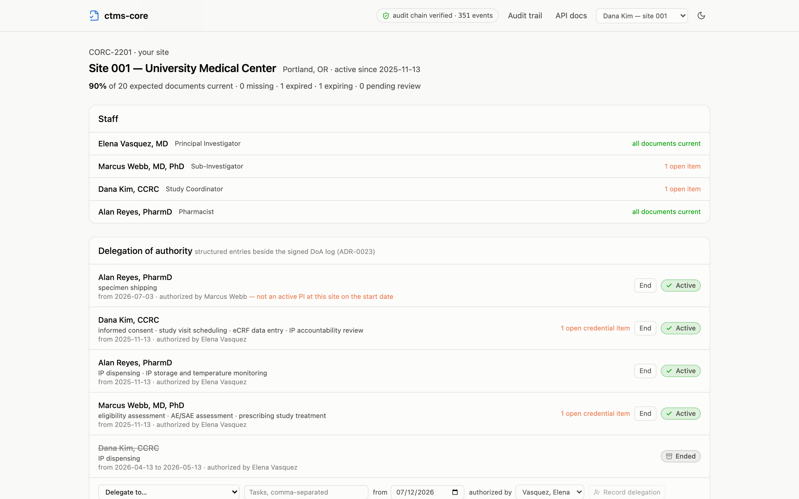
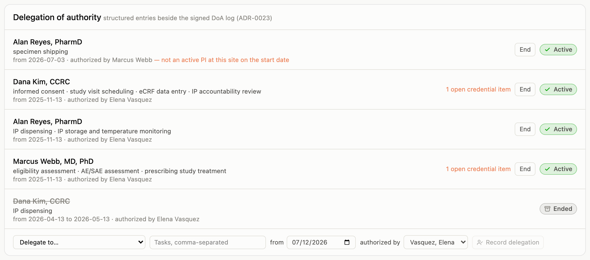
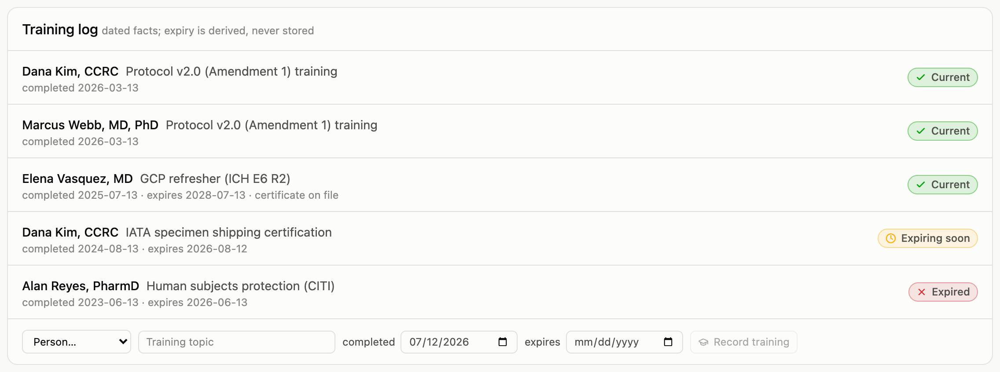

Most of this guide describes the oversight seat: the sponsor or CRO view
across many sites. This page is about the other side of the relationship: a
coordinator or investigator whose access is scoped to their own site.

## Signing in as site staff

A site person holds a **Site staff** grant limited to one site. When they sign
in, the app takes them straight to their site's page. There is no study
dashboard, portfolio, or admin surface to get lost in, because none of those
would show them anything they're permitted to see. What they get is their
site, whole: staff roster, the two logs below, enrollment reporting, and every
expected document with an upload button where one is needed.

Site staff can upload documents and sign them (a PI signing their Form FDA
1572, for instance), and they record their site's enrollment counts. What
they cannot do is approve documents, administer the study, or read anything
beyond their site; those denials are immediate and name the missing
permission.

In the demo, the header's persona menu switches to **Dana Kim — site 001**
to try this seat.

## The delegation of authority log

Every site keeps a delegation of authority log: who the investigator has
delegated which study tasks to, from when. The paper (or PDF) log the PI
signs is still filed and signed as a document. What this page adds is the
*structured* entries beside it, so delegation becomes something the system
can check rather than a scan nobody reads.

Each entry names the delegate, the delegated tasks, the start date, and the
investigator who authorized it. Ending a delegation records an end date;
entries are never edited or deleted, and every change lands in the audit
trail. Because the entries are data, two checks run on every view:

- **Was the authorizer actually the PI?** If the authorizing person did not
  hold an active principal-investigator role at that site on the entry's
  start date, the entry says so, right on the log.
- **Is the delegate's file in order?** If the delegate has open credential
  items (an expired medical license, a missing GCP certificate), the entry
  carries the count. A delegation to someone whose license lapsed is exactly
  the finding a monitor wants surfaced before an inspector finds it.

## The training log

The training log records completions as dated facts: who, what topic, when,
and (when the training expires) until when. An entry can link to the filed
certificate document. As everywhere else, the status (current, expiring
soon, expired) is computed from the dates on every page load, never stored.

## Who writes the logs

The logs are the site's record of itself. Site staff and administrators can
write entries; monitors and trial operations read them: oversight reviews
the log, it does not author it. The signed delegation log document remains
the authoritative Part 11 record; signing individual entries electronically
is on the roadmap, not claimed today.
